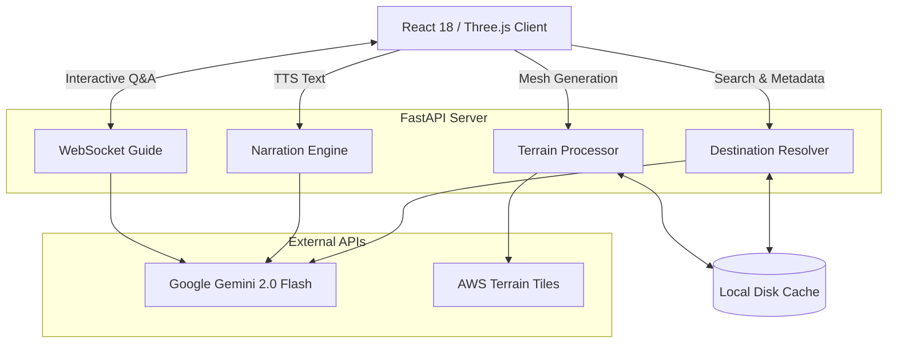

# Odyssey

> A multilingual 3D travel guide that allows users to fly over real elevation terrain of any destination globally, accompanied by synthesized voice narration in multiple languages.

## Features

| Feature | Description |
|---|---|
| **Destination Search** | Resolves user input into geographic bounds and metadata using Gemini 2.0 Flash. |
| **Real Elevation** | Decodes AWS Terrain Tiles (Terrarium encoding) into an accurate 3D mesh. |
| **Hypsometric Coloring** | Automatically colors terrain based on elevation profiles (valleys to snow peaks). |
| **Free-flight Mode** | Fluid WASD controls to navigate and soar freely over the environment. |
| **Multilingual Support** | Narration available in 20 languages. |
| **Live Voice Guide** | Persistent WebSocket connection allowing conversational Q&A about the destination. |
| **Voice Input** | Integrated Web Speech API for voice-driven interactions. |
| **Smart Caching** | Terrain and destination metadata are cached locally to minimize redundant API calls. |

## Quick Start

### 1. Prerequisites and Setup

Clone the repository and set up your environment variables:

```bash
git clone https://github.com/Aaditya-Chunekar/odyssey
cd odyssey

cp .env.example .env
```

Ensure you add your `GEMINI_API_KEY` to the `.env` file. You can obtain a key from [Google AI Studio](https://aistudio.google.com).

### 2. Backend Initialization

Install the necessary Python dependencies and start the FastAPI server:

```bash
cd backend
pip install -r requirements.txt
cd ..

# Start the backend server on http://localhost:8000
python run.py
```

### 3. Frontend Initialization

In a separate terminal, install the Node dependencies and start the Vite development server:

```bash
cd frontend
npm install

# Start the frontend dev server on http://localhost:3000
npm run dev
```

Navigate to `http://localhost:3000` in your browser to start exploring.

## Project Structure

```text
odyssey/
├── backend/
│   ├── main.py                    # FastAPI routes (resolve, terrain, narration, WS voice)
│   └── terrain.py                 # AWS Terrain Tile fetching and Terrarium decoder
├── frontend/
│   └── src/
│       ├── App.jsx                # Phase router
│       ├── store.js               # Zustand global state
│       ├── index.css              # Global styles
│       ├── components/
│       │   ├── SearchScreen.jsx   # Landing and destination search
│       │   ├── LoadingScreen.jsx  # Animated loading with step progress
│       │   ├── TerrainScreen.jsx  # Main 3D viewer and HUD
│       │   ├── TerrainViewer.jsx  # Three.js R3F canvas and fly controls
│       │   ├── GuidePanel.jsx     # Narration and live voice chat
│       │   └── DestinationInfo.jsx# Metadata sidebar
│       ├── hooks/
│       │   └── useVoiceGuide.js   # WebSocket and TTS hook
│       └── utils/
│           └── api.js             # Axios API helpers
├── cache/                         # Auto-created cache for terrain and destination files
├── run.py                         # Application entry point
├── .env.example
└── README.md
```

## Controls

| Mode | Input | Action |
|---|---|---|
| **Orbit** | Left Click + Drag | Rotate camera view |
| **Orbit** | Scroll Wheel | Zoom in and out |
| **Fly** | `W` / `↑` | Move forward |
| **Fly** | `S` / `↓` | Move backward |
| **Fly** | `A` / `←` | Strafe left |
| **Fly** | `D` / `→` | Strafe right |
| **Fly** | `E` | Ascend |
| **Fly** | `Q` | Descend |

## System Architecture



### Logic Flow

1. **Resolution Interface:** The user inputs a location (e.g., "Patagonia, Argentina"). The backend calls Gemini 2.0 Flash to resolve geographic bounding boxes, contextual facts, and location descriptions. This metadata is stored locally in the `cache/` directory.
2. **Terrain Generation:** Bounding box coordinates are translated into spatial tile coordinates. The backend fetches RGB-encoded PNGs from AWS S3 (Terrarium format), which are decoded into a heightmap elevation grid to dynamically reconstruct a 3D mesh within React Three Fiber.
3. **Narration Synthesis:** Gemini 2.0 Flash dynamically generates localized, semantic descriptions of the terrain, and passes this string back to the client application to be spoken aloud using the native browser Web Speech API.
4. **Live Interaction:** A stateful WebSocket connection maintains chat history, enabling a seamless conversational interface regarding the destination environment.

## Supported Languages

English, Spanish, French, German, Italian, Portuguese, Japanese, Chinese (Mandarin), Korean, Arabic, Hindi, Russian, Dutch, Swedish, Thai, Vietnamese, Turkish, Polish, Czech, Greek

## Tech Stack

- **Frontend:** React 18, Vite, Three.js (@react-three/fiber), Zustand
- **Backend:** Python, FastAPI
- **AI Models:** Google Gemini 2.0 Flash
- **Elevation Data:** AWS Terrain Tiles (Terrarium RGB mapping)
- **Audio & Input:** Web Speech API, Web Speech Recognition API

## Notable Design Decisions

- **Cache-first Optimization:** To significantly reduce API overhead and redundant requests, all geographic and AI resolution payloads are synchronously written to `./cache/` utilizing unique hash identifiers. Consecutive queries immediately load the saved schema instead of triggering external requests.
- **Browser-native Capabilities:** To fully minimize architectural costs, audio processing strictly utilizes the native Web Speech API built into Chromium and equivalent modern browser engines, avoiding secondary vendor-lock.
- **Continuous Conversation Mapping:** The virtual guide module utilizes constant WebSocket binding to inherently attach past turns to new prompt states, yielding memory-assisted conversational QA.
